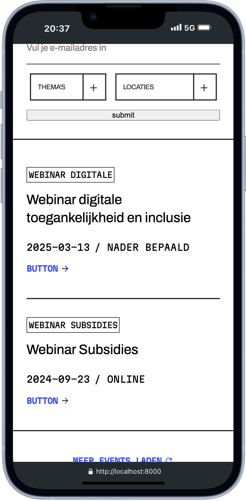

# DDA 

## Inhoudsopgave

- [DDA](#dda)
  - [Inhoudsopgave](#inhoudsopgave)
  - [Beschrijving](#beschrijving)
  - [Gebruik](#gebruik)
  - [Mobile first](#mobile-first)
  - [Functionaliteiten per pagina in het kort](#functionaliteiten-per-pagina-in-het-kort)
    - [Eventspagina](#eventspagina)
    - [Detailspagina](#detailspagina)
    - [Inschrijfformulier](#inschrijfformulier)
  - [Performance enhancement](#performance-enhancement)
    - [Responsive images](#responsive-images)
    - [Webp en avif format](#webp-en-avif-format)
    - [Lazy loading](#lazy-loading)
    - [Width en height toevoegen](#width-en-height-toevoegen)
    - [View transitions](#view-transitions)
    - [Client side scripting](#client-side-scripting)
  - [Kenmerken](#kenmerken)
    - [Gebruikte technologieën](#gebruikte-technologieën)
  - [Installatie](#installatie)
  - [Bronnen](#bronnen)
  - [Licentie](#licentie)

## Beschrijving
Dit project is een opdracht die ik heb ontvangen van het softwarebedrijf De Voorhoede om de website van DDA te maken en te reviseren. Het doel van deze opdracht was om de bestaande website te verbeteren aan de hand van nieuwe designs. Ook is het van belang dat er dynamische data wordt opgehaald vanuit een API of database.

In de huidige sprint 10 wordt de nadruk gelegd op de performance van de website. Dat deze snel laadt en snel oogt voor de gebruiker. Ook wordt er gekeken naar client side scripting voor een betere user experience voor de gebruiker. 

## Gebruik
De pagina is deel van een dynamische en interactieve website waar gebruikers aankomende evenementen kunnen vinden en filteren op basis van locatie en thema. De gebruiker kan vervolgens een inschrijving indienen om zich te melden voor het event.

## Mobile first
Bij de ontwikkeling van de pagina is gewerkt volgens het mobile first-principe. Hierbij is ook rekening gehouden met de responsiveness van de typografie voor grotere schermen. Dit is gedaan door middel van CSS clamp(). Deze aanpak is verwerkt in de styleguide van de basic-styling.

## Functionaliteiten per pagina in het kort

### Eventspagina
Op eventpagina kan de gebruiker een overzicht zien van alle eventen die er zijn. Alle data van de evenementen zijn doormiddel van een GET request opgehaald uit de Directus API. De pagina heeft een hero-section met headline van drie images weergegeven met image. Verder op de pagina bevindt zich de lijst met alle events die de gebruiker vervolgens kan filteren op thema en/of locatie.

### Detailspagina
Wanneer je een events hebt gevonden dat je interesseert, kun je meer informatie bekijken door op de "Details"-button of button te klikken. De gebruiker wordt doorgestuurt naar de detailspagina van betreffende event. De gebruiker kan allerlei informatie vinden over het event. Als de gebruiker zich wilt inschrijven voor het event dient de form worden ingevuld.

### Inschrijfformulier
Als de gebruiker een event heeft gevonden, kan hij zich inschrijven. Hiervoor moet de gebruiker een aantal gegevens invoeren. Alle velden behalve de "tussenvoegsel" moet worden ingevuldt om het formulier te kunnen verzenden. 

Wanneer het formulier wordt verzonden, krijgt de gebruiker visuele feedback. Dit gebeurt door middel van een geanimeerde loader en een verlaagde opacity van het formulier, waardoor het lijkt alsof het niet te gebruiken is. Zodra het formulier succesvol is verzonden, verdwijnt de loader en herstelt de opacity naar de normale waarde. De gebruiker ontvangt vervolgens een tekstueel bericht waarin wordt bevestigd dat de inschrijving succesvol is voltooid.

De POST gebeurt cleint side zodat de page niet refreshed. Ook komt het ingevulde bedrijf gelijk in de tabel door client side.

| hero-section                                             | Filter                                             |
| -------------------------------------------------------- | -------------------------------------------------- |
|  |  |

| Footer                                             | detailspagina                                         |
| -------------------------------------------------- | ----------------------------------------------------- |
|  |  |

## Performance enhancement
Om de performance van de pagina's te verbeteren heb ik een aantal technieken toegepast, waaronder:
- Gebruik maken van responsive images
- Gebruik maken van webp en avif format
- Lazy loading toepassen op bepaalde images
- Een width en height toepassen op images
- View transition toepassen voor perceveid performance
- Client side scripting voor perceveid performance

### Responsive images
Elke image zit nu in een `<picture>` tag. In de picture tag heb ik een aantal source's met verschillende width's aangemaakt. Nu gaat de browser zelf uitzoeken welke source het beste past bij de omstandigheden. Het kijkt of de browser avif of webp ondersteunt en het kijkt naar de media query(schermgrootte). Vervolgens kiest het dan een uit dat geschikt is. Zijn er geen van de source's geschikt dat pakt het de fallback en dat is de ``.

De images die uit de Directus API worden opgehaald zijn alle veel te groot. Als je ze zo groot inlaadt zonder dat je dat nodig hebt gaat je performance achteruit. Door bovenstaande kiest het zelf welke source gunstig is.

Voorbeeld source in eventspagina 
`<source media="(max-width: 360px)" type="image/avif" srcset="https://fdnd-agency.directus.app/assets/{{ headerEvent.photo.id }}?format=avif&width=360">`

### Webp en avif format
Webp en avif is moderne formatting voor images. De bestandsgrootte is kleiner ten opzichte van jpeg of png wat betere performance biedt.

De images uit de Directus API kun je ophalen als format avif of webp. Dit heb ik ook gedaan. Ik heb ook statische images in mijn assets folder. Ik heb in de assets folder ook de webp en de avif format van deze images toegevoegd. En als fallback heb ik de normale format png.

Voorbeeld statische image in footer 
`
<picture>
    <source type="image/avif" srcset="/assets/image5.avif">
    <source type="image/webp" srcset="/assets/image5.webp">
    
</picture>
`

### Lazy loading
Ik heb op de verschillende pagina's een aantal ongeveer 10 images. Om performance te verbeteren heb ik bij bepaalde images lazy loading toegevoegd door de html `<loading>`. Hierdoor worden de images pas ingeladen als ze op het scherm komen. Ik heb lazy loading uitgevoerd op alle images buiten de hero-section. Omdat je deze images gelijk ziet op de pagina.

### Width en height toevoegen
Om layout shifts te voorkomen heb ik een width en height toegevoegt aan elke image. Bij het renderen van de pagina weet de browser wat de height en width van de image is waardoor deze ruimte gereserveerd kan worden. Hierdoor zal de gebruiker geen verschuivingen zien waardoor de user experience verbetert.

Bij de images uit de Directus API moeten deze waardes met de fetch worden meegevraagt. Dit wordt gedaan door `photo.id,photo.width,photo.height` toe te voegen aan de fetch.

Voor het bepalen van de waardes van de statische images heb ik een online image inspector gebruikt.

### View transitions
Om ervoor te zorgen dat de website snel is maar ook dat de website als snel wordt ervaren door de gebruiker heb ik een view transition toegevoegd door de view transitions API.

Dit is een multi page transition. Doordat ik de `view-transition-name: event-image-{{id van event}}` op beide images heb gedaan krijg je standaard al een simpele overgangs transition. Maar met css heb ik het aangepast.

`view-transition-name: event-image-{{id van event}}` Dit moet bij beide pagina's hetzelfde zijn. Op de eventpage heet de id Headerevent en op de detailspagina heet het eventDetails.

In de css code snippet hieronder gebruik ik `event-image-*`. Het sterretje betekend dat het alles pakt wat na `event-image-` komt. De `style="view-transition-name: event-image-{{ eventDetails.id }}` en `style="view-transition-name: event-image-{{ headerEvent.id }}"` hebben een andere variabele naam voor de id, maar hebben dezelfde id.

`::view-transition-old` Dit is het eerste element waarop de transition uitgevoerd zal worden (pagina-1)
`::view-transition-new` Dit is het tweede element waarop de transition uitgevoerd zal worden (pagina-2)

https://github.com/Ravirkt/user-experience-enhanced-website/blob/a3b7c5089186f82cb4af6ef60c29c44d3e7eba22/public/styles/view-transition.css#L5-L11

| View-transition                                             
| -------------------------------------------------------- | 
|  | 

### Client side scripting
Om ervoor te zorgen dat de pagina niet refreshed bij de POST en dat het ingeschreven bedrijf gelijk zichtbaar is zonder refresh is er gebruik gemaakt van client side scripting.

| Post en get zonder refresh                                             
| -------------------------------------------------------- | 
|  | 

## Kenmerken
Voor dit project heb ik gebruik gemaakt van veel moderne webtechnieken, waaronder:

### Gebruikte technologieën
- **HTML & CSS**  
  De basisstructuur en styling van de website zijn opgebouwd met HTML en CSS. De huisstijl van de website is in een aparte styleguide verwerkt.

- **Server-side JavaScript**  
  Voor de back-end is gebruik gemaakt van Node.js en Express om een dynamische en efficiënte webserver te creëren. Nodejs zorgt ervoor dat ik Javascript serverside kan gebruiken en Express maakt mogelijk om routes te maken en responses en requests te verwerken.

- **Liquid Templates**  
  De weergave van de pagina’s gebeurt met behulp van Liquid Templates, waardoor dynamische data eenvoudig kan worden ingeladen en eventueel gemanipuleerd met liquid functies.  

- **Directus APi**
  De data die wordt opgehaald kom uit de Directus Api. Doormiddel van API endpoint url's kunnen vervolgens specifieke data worden opgevraagt.

- **Nodemon**  
  Voor efficienty is er gebruik gemaakt van Nodemon tijdens de development. Dit zorgt ervoor dat de server automatisch herstart bij wijzigingen in de code.

## Installatie
Project lokaal installeren

1. **Fork de repository**  
   Ga naar de [repository pagina](https://github.com/Ravirkt/user-experience-enhanced-website) en klik op de **Fork** knop in de rechterbovenhoek om een kopie van de repository naar je eigen GitHub account te maken.

2. **Clone de repository**  
   Clone je geforkte repository naar je lokale computer door het volgende commando uit te voeren in de terminal: git clone https://github.com/Ravirkt/user-experience-enhanced-website

3. **Installeer de packages**  
   Voer in de terminal de command **npm install** uit om de packages uit de package.JSON te installeren.

4. **Start de server**  
   Voer in de terminal de command **npm start** uit om de server te starten.

## Bronnen

## Licentie

This project is licensed under the terms of the [MIT license](./LICENSE).

